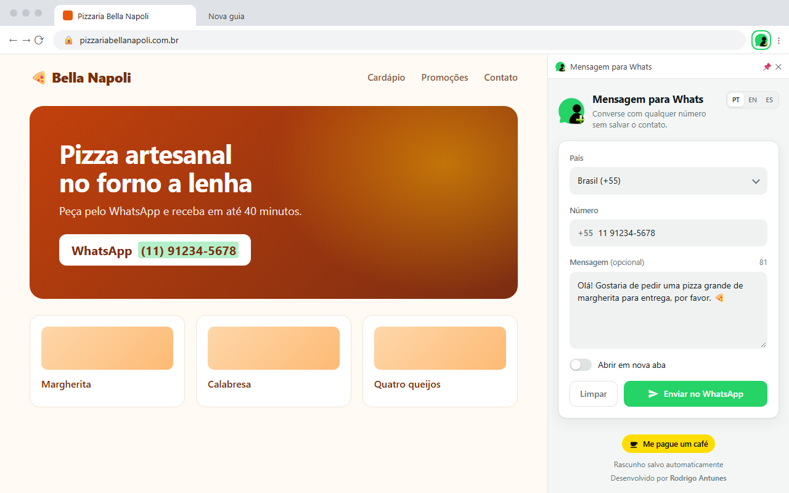
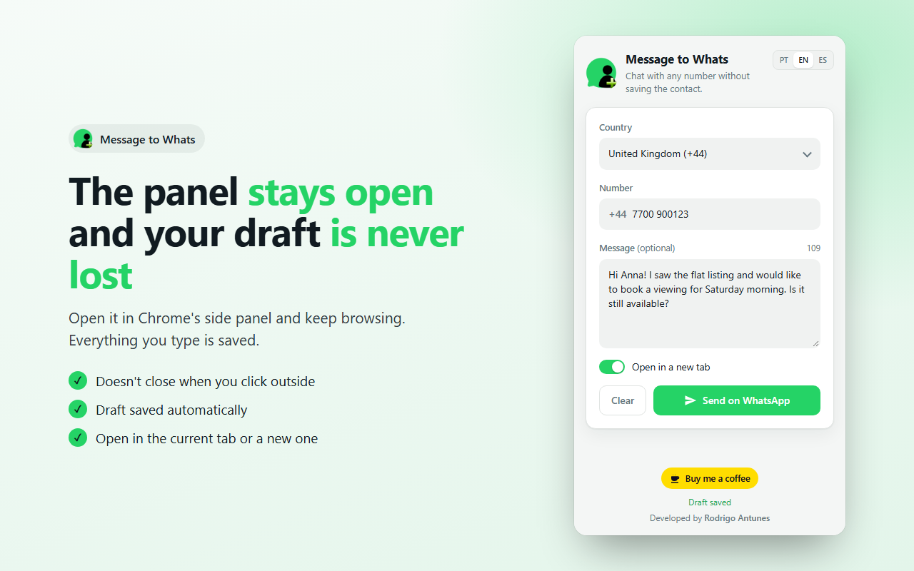
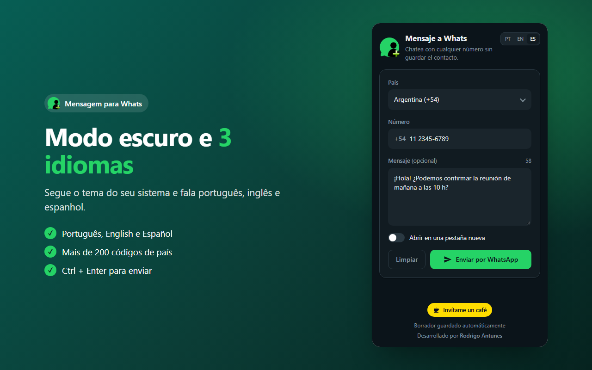

# Message to Whats

Chrome extension to send a **WhatsApp** message to any number **without saving the contact**. Pick the country, type the number, write a message (optional) and WhatsApp Web opens straight in the chat.

> 🇧🇷 Extensão do Chrome para mandar mensagem no WhatsApp para qualquer número sem salvar o contato. Disponível em português, inglês e espanhol.

**[Add to Chrome](https://chromewebstore.google.com/detail/onkiceljenjccmakdelhfnnmekpgdpnk)** · [Website](https://antunescode.com/mtowhatsapp) · [Support / FAQ](https://antunescode.com/mtowhatsapp/support) · [Privacy policy](https://antunescode.com/mtowhatsapp/privacy)



## Features

- **Side panel** that stays open while you browse — it doesn't close when you click outside
- **Draft saved automatically**: country, number and message survive closing the panel or the browser
- Over 200 country codes, with the dial code shown next to the number
- Open WhatsApp Web in the current tab or in a new one
- Automatic **dark mode**
- **English, Português and Español**, with a language switcher (country names translated too)
- `Ctrl + Enter` to send
- No sign-up, no ads, no tracking — nothing leaves your computer

| | |
|---|---|
|  |  |

## Privacy

The extension uses only two permissions:

- `sidePanel` — to show the UI in Chrome's side panel;
- `storage` — to keep the draft and preferences in `chrome.storage.local`, on your device only.

No data is collected or sent anywhere. The number and message only go to WhatsApp when you open the chat. Full policy: [antunescode.com/mtowhatsapp/privacy](https://antunescode.com/mtowhatsapp/privacy).

## Development

Requires Chrome 116+.

1. Clone the repo.
2. Open `chrome://extensions/` and turn on **Developer mode**.
3. Click **Load unpacked** and choose the project folder.
4. Click the extension icon — the side panel opens. After editing the code, hit the reload button on the extension card.

### Project structure

```
manifest.json         Manifest V3
sidepanel.html        UI (side panel)
css/sidepanel.css     styles, light/dark theme
js/sidepanel.js       form, draft saving, opening WhatsApp Web
js/i18n.js            PT / EN / ES translations and country names
js/background.js      service worker: opens the side panel on icon click
_locales/             extension name/description per language
store-assets/         Chrome Web Store images and listing texts
scripts/build-zip.py  builds the package to upload to the store
```

### Packaging for the Chrome Web Store

```bash
python scripts/build-zip.py
```

Creates `dist/message-to-whats-v<version>.zip` with only the files the extension needs. Bump `version` in `manifest.json` before each upload.

Store images are generated from HTML templates with headless Chrome (needs Pillow):

```bash
python store-assets/src/render.py
```

## Changelog

**2.2.1 — 06/10/2026**
- Rebuilt for **Manifest V3** — the old Manifest V2 version stopped being supported by Chrome
- Popup replaced by Chrome's **side panel**, which doesn't close when you click outside
- Automatic draft saving (country, number, message)
- Brand-new design with dark mode
- English, Portuguese and Spanish, with a language switcher
- "Open in a new tab" option and `Ctrl + Enter` shortcut
- Message is URL-encoded (accents, `&` and line breaks work); spaces and dashes in the number are ignored
- Pakistan (+92) and fixed dial codes for Czech Republic, Georgia, Liechtenstein, Dominica and the Virgin Islands
- Buy Me a Coffee button

**05/11/2024** — Translations: PT, ES, EN

**07/07/2020** — Pakistan code; support button

**05/02/2019** — Button text changed to "Send"

**03/02/2019** — Message no longer required; opens WhatsApp Web directly

**02/02/2019** — Style update

## Support the project

If it saves you time, [buy me a coffee ☕](https://buymeacoffee.com/jnjrai6).

Made by [Rodrigo Antunes](https://antunescode.com). Not affiliated with WhatsApp or Meta.

## License

MIT
